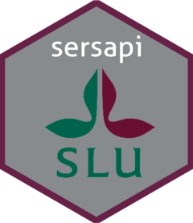

<!-- README.md is generated from README.Rmd. Please edit that file -->

# dvfisk: Query and Get Data from [DVFISK](https://dvfisk.slu.se/) 

Install development version from GitHub:

``` r
# install.packages("devtools")
remotes::install_github("kagervall/dvfisk")
```

Package `dvfisk` gives API access to databases maintained by [SLU
Aqua](https://www.slu.se/en/departments/aquatic-resources1/ "Link to SLU Aqua").

Link to dvfisk main page: <https://dvfisk.slu.se/>. Documentation for
API:s provided on <https://dvfisk.slu.se/> can be found on
<https://dvfisk.slu.se/swagger/index.html>

## Swedish Electrofishing Register (SERS)

R API:s available for SERS: **SersAggregerad** (beta) and **SersVix**
(beta).

SersAggregerad gives you aggregated data for all years a site has been
fished. SersVix returns of the data for individual sites for each year
fished with estimates for the density of all species caught and lots of
information about the site and the fishing.

Information about Swedish Electrofishing Register (SERS) is available at
<https://www.slu.se/en/departments/aquatic-resources1/databases/database-for-testfishing-in-streams/>

## Database for Survey test-fishing (NORS)

R API:s are not available for NORS yet.

Information about Database for Survey test-fishing (NORS) is available
at
<https://www.slu.se/en/departments/aquatic-resources1/databases/national-register-of-survey-test-fishing-nors/>

## Database for Coastal Fish (KUL)

R API:s available for KUL: **KulFangst** (beta), **KulIndivid** (beta)
and **KulLangd** (beta).

Information about Database for Coastal Fish (KUL) is available at
<https://www.slu.se/en/departments/aquatic-resources1/databases/database-for-coastal-fish-kul/>
